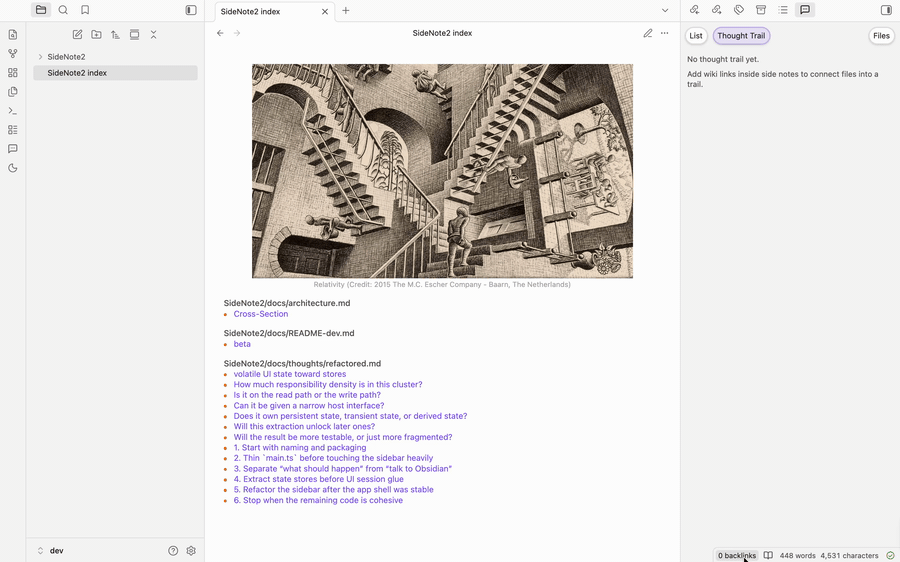
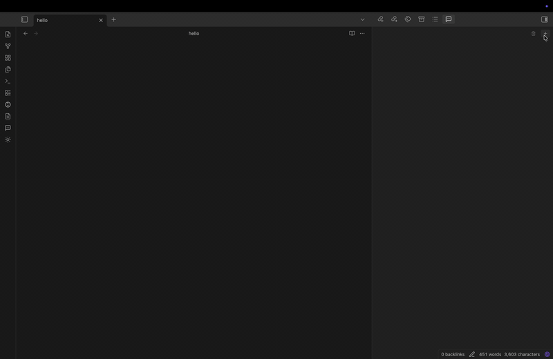

  

Aside

  

<table>
  <tr>
    <td align="center" valign="top" width="50%">
      <strong>Side note index</strong> 
      
    </td>
    <td align="center" valign="top" width="50%">
      <strong>Agent reply</strong> 
      
    </td>
  </tr>
</table>
Aside is a tool for thought. Add side notes to your Obsidian files, connect ideas, and get optional help from local AI agents.

## Features

- **Comment beside your notes.** Add page notes to files, or attach comments to Markdown selections and Canvas cards.
- **Keep track of ideas.** Pin comments, add `#tags` and `[[wikilinks]]`, and mark follow-ups with `@todo`.
- **Find connections.** Browse comments in `🐰 Aside Index.md`, explore links and tags with Thought Trail, and see attachments and URLs in Context.
- **Ask an agent.** Mention `@codex`, `@claude`, `@cursor`, `@gemini`, or `@deepseek` for help on desktop.

See [Context and connections](docs/context.md) for more detail.

For durable storage and sync across devices, use Aside with [Obsidian Sync](https://obsidian.md/sync).

## How to Get Started

Community directory submission is pending.

1. Open **Settings → Community plugins** in Obsidian, find **Aside**, and install and enable it.
2. Open a file and choose **Add page note**, or select Markdown text or a Canvas card and choose **Add comment to selection**.
3. Write your comment and click **Add**.

## Workflow

1. Open a file and add a page note, or select Markdown text or a Canvas card and choose **Add comment to selection**.
2. Write your comment. Use `[[wikilinks]]` to connect notes, `#tags` to organize ideas, and `@todo` for follow-ups.
3. Click **Add**. Use **+** on a saved card to continue the thread with a reply. When editing an existing entry, click **Save**.

## Glossary

- **Thread** — One Aside discussion attached to a file, a text selection, or a Canvas card. It contains a first entry and any replies.
- **Entry** — One message in a thread. The first saved entry creates the thread; later entries are replies.
- **Page note** — A thread attached to a whole file. Page notes work in supported file views, including those provided by viewer plugins. The generated Aside Index is not a page-note target.
- **Anchored note** — A thread attached to a Markdown text selection or a Canvas card. Selecting the comment takes you back to its target.
- **Orphaned note** — An anchored thread whose original text or card can no longer be found. The conversation is preserved even when its anchor is missing.
- **🐰 Aside Index.md** — The generated vault-wide comment index. It helps you browse your comments; it is not their primary storage.
- **Thought Trail** — The relationship view that follows note links and connects files with shared note or side-note tags.

## Writing in Side Notes

| Action | How |
| --- | --- |
| Add a comment or reply | Click **Add**. |
| Save an edit | Click **Save**. |
| Reply to a thread | Click **+** on a saved card. |
| Ask a local agent | Mention `@codex`, `@claude`, `@cursor`, `@gemini`, or `@deepseek` in a new comment or reply, then click **Add**. |
| Link a note | Type `[[` to find or create a note. |
| Add a tag | Type `#` and choose or create a tag. |
| Reopen link or tag suggestions | Press `Tab` inside an unfinished `[[...` or `#...` token. |
| Mark a follow-up | Type `@todo`. |
| Keep a comment handy | Pin its card. |
| Add a line break | Press `Enter`. |
| Cancel an edit | Press `Esc`. |

## Commands

- **Aside: Add comment to selection** — Add an anchored comment to selected Markdown text or a Canvas card.

## Optional agents and scripts

Install and sign in to your preferred local agent CLI, then turn on **Settings → Aside → Enable agents**. Mention the agent in a new comment or reply and click **Add** to start a conversation.

`@deepseek` uses the model selected in your configured OpenCode CLI. Scripts let you run and schedule trusted local commands; only run scripts you trust.

See [Agents and scripts](SCRIPTS.md) for setup and [Scripts and scheduling](docs/scripts.md) for automation.

## License

Aside is free for personal and internal workplace use under the [Aside Proprietary License](LICENSE). Your notes remain yours. Earlier MIT-licensed releases retain their permissions.
